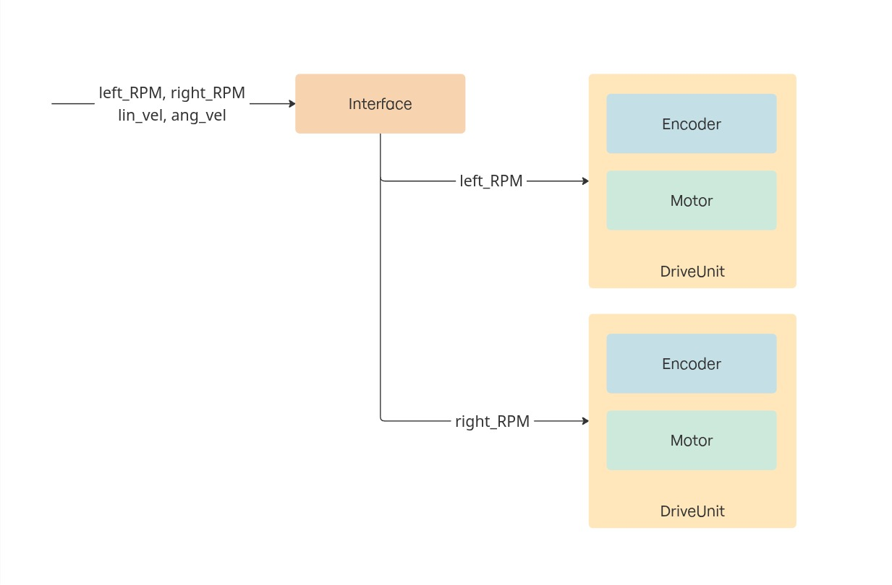
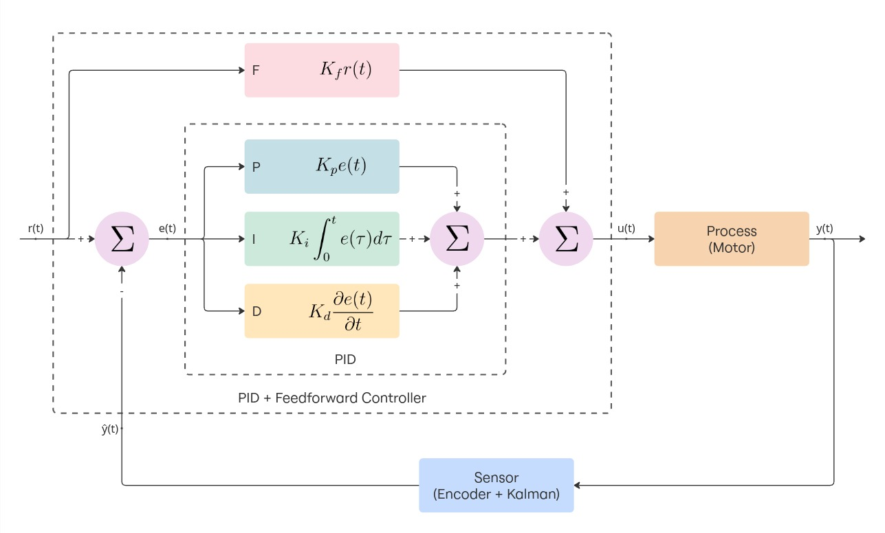

# Differential Drive – Controller

Conceptually, my differential drive robot consists of two computational units, one responsible for **low-level motor control and sensor feedback** (Arduino Nano) and the other for handling **high-level navigation and communication** (Raspberry Pi Zero 2W). This repository contains the **Arduino firmware**.

For a complete overview of the project refer to the [main Differential-Drive repository](github.com/ggldnl/Differential-Drive.git). Take also a look to the [repository containing the Hardware](github.com/ggldnl/Differential-Drive-Hardware).
I documented the design process, construction and theory in [this article](https://ggldnl.github.io/projects/differential_drive/index.html).

## 🔌 Setup Instructions

This repository contain the main cpp code for the low level control of the robot and ROS2 interface as well as several smaller scripts to test the libraries I wrote. 

> ⚠️ **Important:** If you plan to do the same thing I did and use my PCB, **make sure** the Arduino and the Raspberry are **not** connected during the upload. Upload the code before connecting the two.

I used a Makefile to compile and upload code to an Arduino Nano. To compile and upload the main script:

```bash
make main
make upload-main
```

> ⚠️ The baud rate I used is 115200. Older versions use 57600. You can edit the Makefile to accomodate this or use the flag `BAUD=57600` during upload.

If you want to test the hardware or tinker around, you can compile and upload the test scripts this way:

```bash
make test_*
make upload-test_*
```

replacing `*` with the name of the test (`test_blink`, `test_encoders`, `test_motors`, `test_kalman`, `test_pid`).

An example to test the compilation and upload process work:

```bash
make test_blink
make upload-test_blink
```

This will flash the analogue of the standard blink script on the arduino. If this works, you can go on.

> ⚠️ You may have to update the paths to the libraries in the Makefile to match your system.

Notes:
- Make sure the Arduino is connected to the correct port (default /dev/ttyUSB0). You can use the `ls /dev` command before and after connecting the Arduino the your computer to know the correct device name.
- `make clean` removes all build files.

## 🧩 Why avrdude instead of the Ardunio IDE

The Arduino IDE provides a simple environment for compiling and uploading sketches, which makes it great for quick development and for new users. However, it also comes with important limitations that complicate larger projects: one among many is the fact we face a lot of restrictions on how we can organize the projects (directory structure and libraries). Another significant limitation is that the Arduino framework enforces a single entry point per project, allowing only one main sketch to be compiled and executed. In contrast, using plain C++ lets us define multiple executables within the same codebase. Using `avrdude` to upload the compiled binaries gave me the flexibility to manage these tests directly, and to create one of them for each library I developed (encoder, motor, PID, ...).

## ⚙️ Configuration

A configuration script ([`config.hpp`](diffdrive/config.hpp)) is provided where you can specify the pins to which each component is connected and tune PID and Kalman gains. I ended up using a PCB (check out the [Differential-Drive-Hardware repository](github.com/ggldnl/Differential-Drive-Hardare) to know more about this) so the connections in my configuration match the board. You can use a breadboard and reconfigure your connections. Keep in mind that different pins expose different functions (interrupts, PWM).

> ⚠️ You might need to tune the PID and Kalman gains again for your hardware.

## 🧠 System Architecture

<!-- TODO update images -->

*Overview of the Arduino software architecture*


*Control loop: this is what each DriveUnit realizes to stabilize the RPM around the setpoint*

The Arduino firmware is built around the following components:

- The **interface** receives commands from the Raspberry Pi via **UART**, parses them and forwards them to the **DriveUnit** objects.  
    
    It supports two types of control inputs:
  - **Direct RPM commands:** `left_RPM`, `right_RPM`
  - **Velocity commands:** linear (`v`) and angular (`w`) velocity

- Each **DriveUnit** represent one _actuated_ wheel. It includes a motor and its encoder, a PID loop and a 1D kalman filter. At each update cycle, it:

    1. Measures the current wheel RPM using the encoder  
    2. Filters the measurement with a 1D Kalman filter  
    3. Computes the control signal with a PID controller  
    4. Sends the control signal to the motor driver

    This modular design allows each wheel to be independently regulated to the desired speed.

- The **motor** library contains the logic to control a motor using a DRV8833 h-bridge. It exposes methods to coast, brake and drive the motor provided the speed (float in range -1, 1). The DRV8833 can vary the speed of the motors if PWM pins are used.

- The **encoder** provides the feedback required for RPM estimation.  
It can operate in two distinct modes depending on the encoder’s position and resolution:

    | Mode | Description | Output |
    |------|--------------|----------------------|
    | **COUNT_MODE** | For high-resolution encoders (e.g., on motor shaft). Uses tick counting over time. | Returns `(absoluteTicks, 0)` |
    | **PERIOD_MODE** | For low-resolution encoders (e.g., on gearbox output). Uses time between ticks. | Returns `(absoluteTicks, ticksTimeDelta)` |

## 🛞 RPM Computation

Two formulas are used to compute the RPM depending on the encoder mode.

**Count Mode**  
Used when the encoder is mounted on the motor shaft (high resolution, low time delta between subsequent encoder pulses):

```cpp
float computeCountMode(long deltaTicks, long deltaTime, int ticksPerRev) {
  return (60.0f * 1000000.0f * deltaTicks) / (ticksPerRev * deltaTime);
}
```

**Period Mode**  
Used when the encoder is mounted on the output shaft (low resolution, high time delta between subsequent encoder pulses):

```cpp
float computePeriodMode(float tickIntervalMicros, int ticksPerRev) {
  return (60.0f * 1000000.0f) / (tickIntervalMicros * ticksPerRev);
}
```

## 🛠️ Implementation Details

**Encoder**

Pulses can occur at high frequency, especially for high-resolution encoders mounted on the motor shaft. Polling them in the main loop would lead to missed ticks. Each encoder should be updated inside an interrupt service routine (ISR) that triggers on encoder signal rising edge.

The standard pattern for creating and updating an encoder looks like this:

```cpp
Encoder encoder(pin);

void encoderISR() {
  encoder.update();  // increase number of ticks, ...
}

attachInterrupt(digitalPinToInterrupt(pin), encoderISR, RISING);
```

However, this approach requires manually declaring the ISR function and attaching it to the pin every time an encoder is created. To make the encoder setup more user-friendly and reduce the amount of code one should write, I used a static interrupt pattern. This means a predefined number of encoder instances are created and each one has a dedicated static ISR that references the correct encoder object.

This is how instantiation looks with the static ISR pattern:

```cpp
Encoder encoder(pin);
```

This design allows to instantiate an encoder once and forget about ISR setup (handled automatically). Interrupt management is isolated inside the Encoder class.

The trade-off is that some configuration must be hardcoded at compile time (the number of supported encoders).

The Arduino I'm using (Nano) only has 2 interrupt capable pins, so it was unnecessary to support more encoders via software. If you want to support more encoders, you can change this part of the code:

```cpp
// encoder.hpp

static Encoder* _instances[2]; // support 2 encoders
```

```cpp
// encoder.cpp

Encoder* Encoder::_instances[2] = {nullptr, nullptr};  // 2 instances
```

**Why not quadrature encoders?**

Quadrature encoders let you compute not only the speed, but also the direction, at which the wheels are spinnig. This comes at the cost of 2 interrupt capable pins. For two encoders (the minimum for a differential drive robot), it will mean 4 interrupt capable pins in total. As described above I ended up using an Arduino Nano, that only has 2.

Since we are the ones controlling the motors, thus in which direction they are spinning, we already have this information and we can save a pin for each encoder.

**What about the shift_register library?**

A small shift register control library was implemented as part of this project, but it is not currently used. It was designed for future expansion of the platform. More on this [on the article](https://ggldnl.github.io/projects/differential_drive/index.html).

## 🤝 Contribution
Feel free to contribute by opening issues or submitting pull requests. For further information, check out the [main Hexapod repository](github.com/ggldnl/Differential-Drive). Give a ⭐️ to this project if you liked the content.